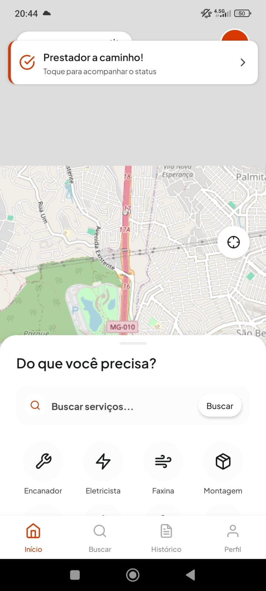
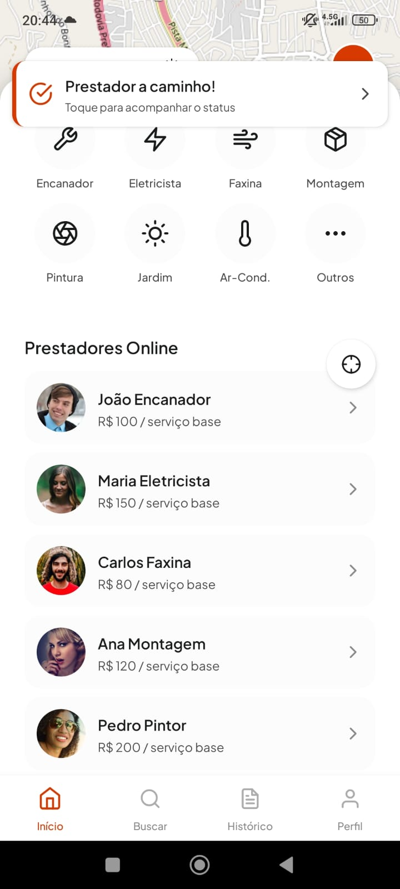
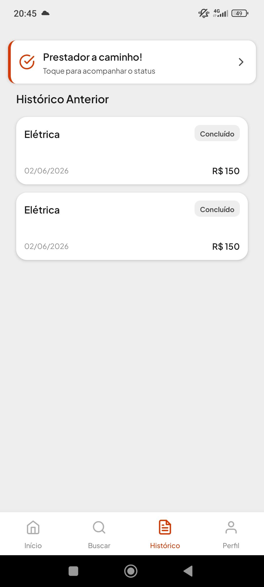
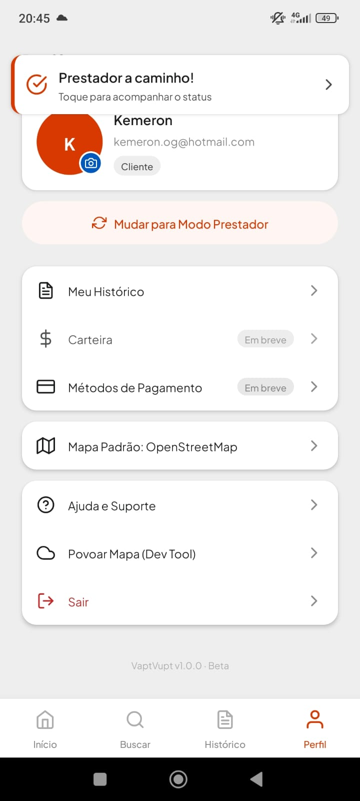

<p align="center">
  
</p>

<h1 align="center">VaptVupt</h1>

<p align="center">
  <strong>O marketplace que conecta quem precisa de um serviço a quem resolve — em tempo real e perto de você.</strong>
</p>

<p align="center">
  
  
  
  
  
</p>

---

## 💡 O Problema

No Brasil, **encontrar um prestador de serviço confiável** (encanador, eletricista, faxineira) é uma experiência frustrante: ligações para números desconhecidos, orçamentos vagos, atrasos, e zero transparência. O cliente não sabe quem está contratando — e o prestador não tem uma vitrine para mostrar seu trabalho.

## 🚀 A Solução

**VaptVupt** é um marketplace mobile de serviços geolocalizados que opera em tempo real. O cliente descreve o que precisa, vê prestadores disponíveis por perto no mapa, solicita o serviço e acompanha tudo — da aceitação ao chat, do tracking ao pagamento — em uma experiência fluida e transparente.

Para o prestador, é uma plataforma completa: dashboard com métricas, carteira de ganhos, gestão de anúncios e visibilidade imediata para clientes da sua região.

---

## 📸 Conheça o App

<p align="center">
  
  
  
  
</p>

---

## ⚙️ Stack Tecnológica

| Camada            | Tecnologia                                                   | Por quê?                                                |
| ----------------- | ------------------------------------------------------------ | ------------------------------------------------------- |
| **App**           | React Native 0.74 + Expo SDK 51                              | Uma codebase, iOS + Android + Web                       |
| **Navegação**     | Expo Router (file-based)                                     | Routing declarativo baseado na estrutura de pastas       |
| **Backend**       | Supabase (PostgreSQL + Auth + Realtime + Storage)            | BaaS completo, open source, com Realtime nativo         |
| **Estado**        | Zustand                                                      | State management leve, sem boilerplate                   |
| **Estilização**   | NativeWind (Tailwind CSS)                                    | Utility-first adaptado para React Native                 |
| **Geocoding**     | Geoapify                                                     | Autocomplete + geocoding reverso (3K req/dia grátis)     |
| **Build**         | EAS Build (Expo)                                             | CI/CD nativo para APK/IPA sem config de Gradle/Xcode     |

---

## 🧩 O Que o VaptVupt Faz

### Para o Cliente
- 🗺️ **Descobre prestadores no mapa** — busca por categoria, nome ou localização com autocomplete inteligente
- ⚡ **Solicita serviço em tempo real** — com tracking de status ao vivo (pending → accepted → on_the_way → completed)
- 💬 **Chat direto** com o prestador vinculado à solicitação
- ⭐ **Avalia o serviço** — rating de 1 a 5 estrelas com trigger automático de atualização de nota no banco
- 📜 **Histórico completo** de todos os serviços solicitados

### Para o Prestador
- 📊 **Dashboard** com métricas do dia (ganhos, serviços realizados, nota média)
- 🔔 **Feed de solicitações** pendentes na região — aceitar ou recusar com um toque
- 💼 **Vitrine de serviços** — cadastro de anúncios em 4 etapas (categoria, descrição, preço, localização)
- 💰 **Carteira** com saldo acumulado
- 🟢 **Toggle de disponibilidade** — fica visível no mapa apenas quando ativo

### Segurança & Infraestrutura
- 🔒 **Row Level Security (RLS)** em todas as tabelas — cada usuário só acessa seus próprios dados
- 📡 **Supabase Realtime** — `postgres_changes` em 5 tabelas para atualizações instantâneas
- 🖼️ **Supabase Storage** — upload de fotos de perfil com URL pública automática
- 🎨 **Design System próprio** ("Kinetic Layer") — tokens de cor, tipografia, espaçamento e sombras

---

## 🛢️ Modelo de Dados

7 tabelas PostgreSQL com RLS, triggers e Realtime habilitado:

```
users ──────────── providers ──────── provider_services
  │                    │
  │                    ├── service_requests
  │                    │         │
  │                    │         ├── reviews
  │                    │         │
  │                    │         └── chats ── messages
  │                    │
  └────────────────────┘
```

| Tabela              | Função                                                       |
| ------------------- | ------------------------------------------------------------ |
| `users`             | Perfis (client \| provider) com auth vinculado ao Supabase   |
| `providers`         | Disponibilidade, localização, rating, saldo                  |
| `provider_services` | Anúncios individuais de serviço                              |
| `service_requests`  | Solicitações com ciclo de vida em tempo real                  |
| `reviews`           | Avaliações (trigger auto-recalcula rating do provider)       |
| `chats`             | Conversas vinculadas a solicitações                          |
| `messages`          | Mensagens em tempo real entre cliente e prestador            |

Schema completo: [`supabase_schema.sql`](./supabase_schema.sql)

---

## 🏃 Começando

```bash
# 1. Instalar dependências
npm install

# 2. Configurar variáveis de ambiente (.env)
EXPO_PUBLIC_SUPABASE_URL=https://seu-projeto.supabase.co
EXPO_PUBLIC_SUPABASE_ANON_KEY=sua_anon_key
EXPO_PUBLIC_GEOAPIFY_API_KEY=sua_chave_geoapify

# 3. Executar o supabase_schema.sql no SQL Editor do Supabase Dashboard

# 4. Rodar
npx expo start
```

---

## 📂 Estrutura do Projeto

```
app/
├── (auth)/         → Onboarding, login, cadastro
├── (client)/       → Home, mapa, detalhe, tracking, chat, avaliação, histórico, perfil
└── (provider)/     → Dashboard, carteira, serviços, solicitações, perfil

lib/                → Supabase client, database CRUD, geocoding, storage, geo utils
store/              → Zustand stores (auth, requests, provider, settings)
components/         → UI reutilizável (botões, inputs, banners, splash)
constants/          → Design tokens (Kinetic Layer), ícones, localização PT-BR
types/              → Interfaces TypeScript
```

---

## 📦 Build & Deploy

```bash
# Desenvolvimento
npx expo start

# APK de preview
eas build --profile preview --platform android

# Build de produção
eas build --profile production --platform android
```

---

<p align="center">
  <strong>VaptVupt</strong> — Resolveu? Avaliou. Simples assim. ⚡
</p>
